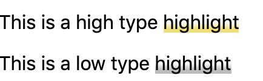

# Highlight component

## Table of contents
  - [What it does](#what-it-does)
  - [How to use](#how-to-use)
  - [Dependencies](#dependencies)
  - [Developer](#developer)
  - [Changelog](#changelog)

<div style="text-align:center"></div>

## What it does 
* Generate highlighted text

## How to use
Import and implement component

```js
import Highlight from 'components/highlight/Highlight'

<Highlight 
  variant='high' // optional
>
  text
</Highlight>
```

## Dependencies
* [Styled-components](https://styled-components.com/)

## Developer
[Shabier](https://www.github.com/sjagoori)

## Changelog

### 1.0
* Initial creation